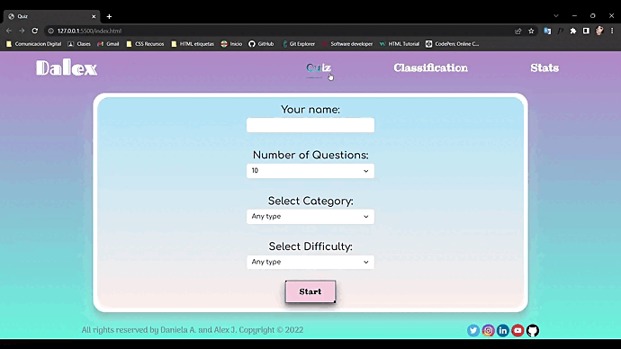
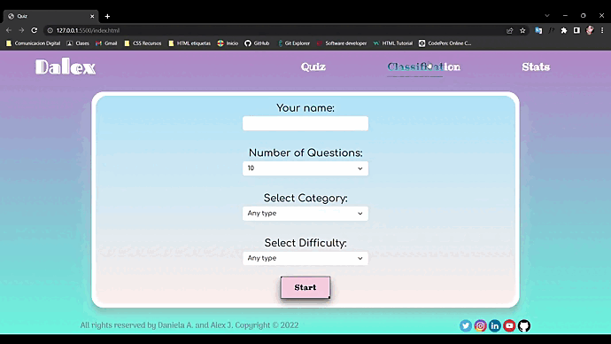
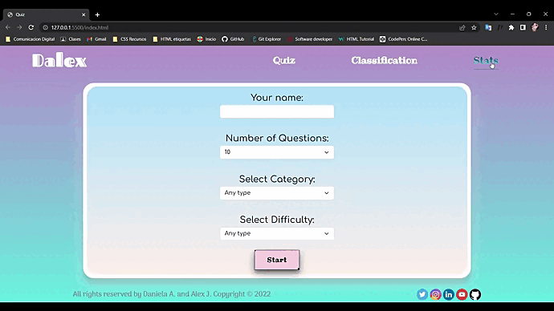
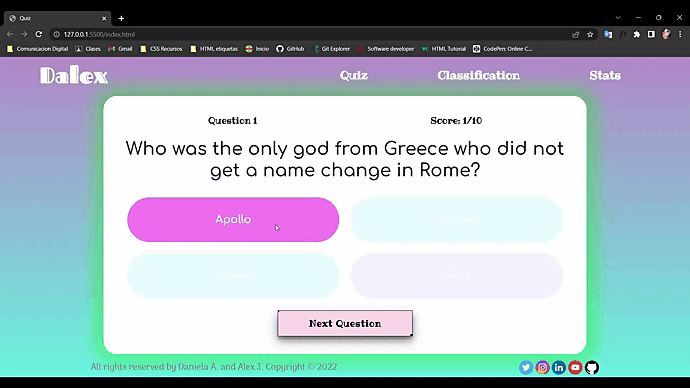
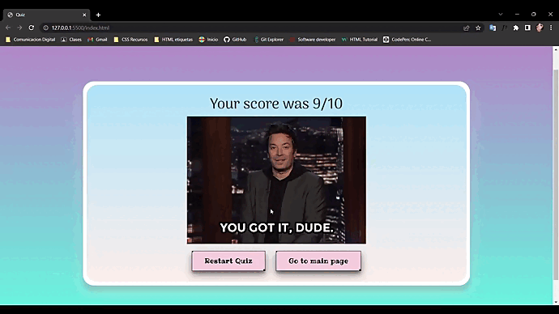
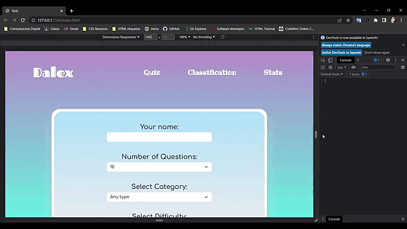

# DALEX 🤘
Welcome to Our Quiz Game

This project has been realized with

- Dynamic DOM manipulation
- Creating a SPA page for the questions
- ES6 handling
- Asynchrony.
- HTML5 APIs
- Local storage, graphics 
- Project management from the beginning in a single shared repository (as contributors) on Github
- clean code and best practices
- Readme with explanation of the project.
- Among many other things

## ➣ Home 
On our home page, you can find the form to start the quiz.

 

## ➣ Nav 
In the Nav, you can see our personal brand and you will find the navigation bar, in which are located the rankings and statistics.

## ➣ Rankings 
The rankings have a top 10, you can see the name of each player, the number of times played, correct and incorrect answers.

## ➣ Statistics 
For the statistics, you will see reflected the information of our rankings, in a more detailed way, not only for all players, but for each of the users.

## ➣ Start Game 
Once the game is started, you will see that each correct answer will light up in green 🙂, while the wrong ones will light up in red 🙁

## ➣ End of Quiz 
At the end of the quiz and according to your result, you will see a beautiful gif of Jimmy Fallon.
You will be able to return to the same quiz, although your questions will change randomly, or you can go to the home page to start again, in the one you want. 

## ➣ Responsive 
It also has responsive, so you can see where you see it, in the best way, adapting to you.

## Enjoy!! 

